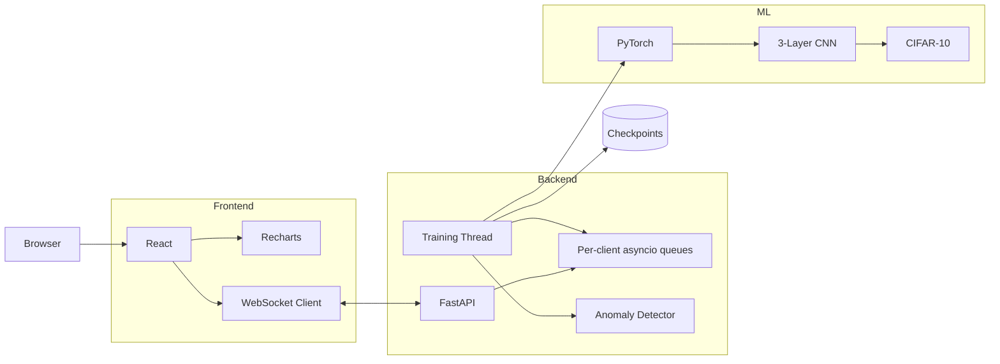

<div align="center">

# 📊 ML Training Inspector

### Real-Time Machine Learning Training Monitor

**Live metrics · Gradient monitoring · Anomaly detection · Early stopping · Checkpointing**

<p>
  <a href="https://youtu.be/x7-KYXCESMw">
    
  </a>
  <a href="https://github.com/azim-haffar/ml-training-inspector">
    
  </a>
</p>

<p>
  
  
  
  
  
  
</p>

</div>

---

## Overview

**ML Training Inspector** is a real-time dashboard for monitoring machine-learning training runs while they are happening.

Instead of waiting for training to finish and inspecting metrics afterward, the application streams training state from a PyTorch process to a browser dashboard using **WebSockets**.

It monitors:

- training and validation loss
- accuracy
- per-layer gradient norms
- vanishing and exploding gradients
- overfitting signals
- loss and accuracy plateaus
- training progress
- checkpoints

The current demonstration trains a **3-layer CNN on CIFAR-10** and exposes its internal training behaviour through a FastAPI backend and React frontend.

---

## 🎬 Demo

<div align="center">

### Watch the Training Inspector in Action

<a href="https://youtu.be/x7-KYXCESMw">
  
</a>

</div>

---

## 🎯 Why I Built It

A training run can finish with a reasonable final metric while still hiding important problems:

```text
When did the loss plateau?

Did validation performance start degrading?

Did gradients vanish halfway through training?

Did one layer behave differently from the others?

Was continuing the run actually useful?
```

ML Training Inspector exposes those signals **while training is running**.

The goal is not to replace full experiment-tracking platforms. It is a focused tool for observing the behaviour of a training loop in real time.

---

## ✨ Features

<table>
<tr>
<td width="50%" valign="top">

### 📉 Live Metrics

- Batch-level loss streaming
- Epoch-level training loss
- Validation loss
- Training accuracy
- Validation accuracy
- Real-time progress updates

</td>

<td width="50%" valign="top">

### 🧠 Gradient Monitoring

- Per-layer gradient norms
- Live visualisation
- Vanishing-gradient detection
- Exploding-gradient detection
- Visual warning states

</td>
</tr>

<tr>
<td width="50%" valign="top">

### 🚨 Anomaly Detection

Detects signals associated with:

- overfitting
- vanishing gradients
- exploding gradients
- loss plateaus
- accuracy plateaus

</td>

<td width="50%" valign="top">

### 💾 Training Control

- Stop a run manually
- Save model state
- Save optimizer state
- Automatic checkpoint creation
- Checkpoints on completion or early stop

</td>
</tr>
</table>

---

## 🏗️ Architecture



---

## 🔄 Real-Time Data Flow

```text
PyTorch Training Loop
        │
        │ metrics
        ▼
Background Training Thread
        │
        ├── loss
        ├── accuracy
        ├── gradient norms
        ├── epoch progress
        └── anomaly state
        │
        ▼
FastAPI
        │
        ▼
Per-client asyncio queues
        │
        ▼
WebSocket
        │
        ▼
React Dashboard
        │
        ├── Loss Charts
        ├── Accuracy Charts
        ├── Gradient Monitor
        ├── Anomaly Alerts
        └── Progress
```

---

## ⚙️ Engineering Highlights

<table>
<tr>
<td width="50%" valign="top">

### 🔌 WebSocket Streaming

Training metrics are pushed continuously from the backend to connected browser clients.

This avoids polling and allows the dashboard to update as the training loop progresses.

</td>

<td width="50%" valign="top">

### 🧵 Background Training Thread

The PyTorch training loop runs separately from the FastAPI request/event loop.

This allows the API and WebSocket layer to remain responsive while model training is active.

</td>
</tr>

<tr>
<td width="50%" valign="top">

### 📡 Multi-Client Broadcasting

Each WebSocket client receives metrics through its own **asyncio queue**.

```text
Training Thread
      │
 ┌────┼────┐
 ▼    ▼    ▼
 Q1   Q2   Q3
 │    │    │
 ▼    ▼    ▼
Tab1 Tab2 Tab3
```

Multiple browser tabs can observe the same run without competing for a single queue.

</td>

<td width="50%" valign="top">

### 🛑 Safe Early Stop

A shared stop signal allows the active training run to terminate early.

The application then saves:

```text
Model state
+
Optimizer state
+
Training checkpoint
```

</td>
</tr>
</table>

---

## 🚨 Anomaly Detection

The backend checks training behaviour while metrics are produced.

### Gradient anomalies

```text
Gradient norm too small
        │
        ▼
Possible vanishing gradient
```

```text
Gradient norm too large
        │
        ▼
Possible exploding gradient
```

### Generalization behaviour

```text
Training improves
       +
Validation degrades
       │
       ▼
Possible overfitting
```

### Plateau detection

```text
Metric changes become very small
            │
            ▼
      Possible plateau
```

These checks are threshold-based signals designed to make training behaviour visible; they are not a substitute for model-specific diagnosis.

---

## 🧪 Training Setup

The included demonstration uses:

```text
Dataset
   │
   ▼
CIFAR-10
   │
   ▼
3-Layer CNN
   │
   ▼
PyTorch Training Loop
   │
   ▼
Real-Time Monitoring
```

The demonstration model reaches approximately:

```text
75–78% validation accuracy
```

within around **10 epochs** under the current setup.

The objective is not maximizing CIFAR-10 performance; the model exists to produce realistic training dynamics for the monitoring system.

---

## 🛠️ Tech Stack

<div align="center">

### Machine Learning


<br>

`Python 3.11` · `PyTorch` · `torchvision` · `CIFAR-10`

<br><br>

### Backend


<br>

`FastAPI` · `WebSockets` · `asyncio`

<br><br>

### Frontend


<br>

`React 18` · `Vite` · `Recharts`

<br><br>

### Infrastructure


<br>

`Docker` · `Docker Compose`

</div>

---

## 📊 Dashboard Components

The frontend is split into focused monitoring components.

| Component | Purpose |
|---|---|
| `LossChart` | Epoch-level train / validation loss |
| `BatchLossChart` | Live scrolling batch loss |
| `AccuracyChart` | Training / validation accuracy |
| `GradientChart` | Per-layer gradient norms |
| `AnomalyPanel` | Training anomaly alerts |
| `ProgressBar` | Current training progress |
| `useTrainingSocket` | WebSocket connection and reconnection |

---

## 💾 Checkpointing

Checkpoints are automatically created when training:

```text
finishes normally
```

or

```text
is stopped early
```

Files are stored under:

```text
backend/checkpoints/
```

using names such as:

```text
model_epoch_N.pth
```

The checkpoint includes both the model and optimizer state.

---

## 🚀 Quick Start

### Option 1 — Docker

The easiest way to run the project is with Docker Compose.

```bash
git clone https://github.com/azim-haffar/ml-training-inspector.git
cd ml-training-inspector

docker-compose up
```

Open:

```text
http://localhost:3000
```

Configure a training run and select **Start Training**.

### First launch

CIFAR-10 is approximately **170 MB** and is downloaded automatically on the first run.

The dataset is stored in a Docker volume so later runs do not need to download it again.

---

## 💻 Run Without Docker

### Backend

```bash
cd backend

pip install -r requirements.txt

uvicorn main:app --reload
```

### Frontend

Open another terminal:

```bash
cd frontend

cp .env.example .env

npm install
npm run dev
```

Then open:

```text
http://localhost:5173
```

---

## 📁 Project Structure

```text
ml-training-inspector/
│
├── backend/
│   ├── main.py
│   │   └── FastAPI server
│   │       WebSocket handling
│   │       Start / stop endpoints
│   │
│   ├── trainer.py
│   │   └── CNN model
│   │       PyTorch training loop
│   │       Stop-event handling
│   │
│   ├── anomaly.py
│   │   └── Threshold-based
│   │       anomaly detection
│   │
│   ├── checkpoints/
│   ├── .env.example
│   └── requirements.txt
│
├── frontend/
│   └── src/
│       ├── App.jsx
│       │
│       ├── components/
│       │   ├── LossChart.jsx
│       │   ├── BatchLossChart.jsx
│       │   ├── AccuracyChart.jsx
│       │   ├── GradientChart.jsx
│       │   ├── AnomalyPanel.jsx
│       │   └── ProgressBar.jsx
│       │
│       └── hooks/
│           └── useTrainingSocket.js
│
├── docker-compose.yml
└── README.md
```

---

## 🔍 What This Project Demonstrates

This project combines **machine-learning internals with software engineering**.

```text
PyTorch Training
       +
Gradient Inspection
       +
FastAPI
       +
WebSockets
       +
Async Messaging
       +
React Visualization
       +
Docker
```

The strongest engineering evidence is the connection between the training process and the live monitoring system:

- instrumenting a PyTorch training loop
- extracting useful runtime metrics
- moving blocking training work outside the API event loop
- broadcasting state to multiple clients
- managing WebSocket connections
- visualizing continuously changing data
- stopping training safely
- preserving checkpoints

---

## 🎬 Demo

<div align="center">

<a href="https://youtu.be/x7-KYXCESMw">
  
</a>

<a href="https://github.com/azim-haffar/ml-training-inspector">
  
</a>

</div>

---

## 📄 License

MIT © 2026 Azim Haffar

---

<div align="center">

## Built by Azim Haffar

**Machine Learning · Backend Engineering · Real-Time Systems**

<a href="https://azimx.dev">
  
</a>

<a href="https://www.linkedin.com/in/azim-haffar">
  
</a>

<a href="https://github.com/azim-haffar">
  
</a>

</div>
